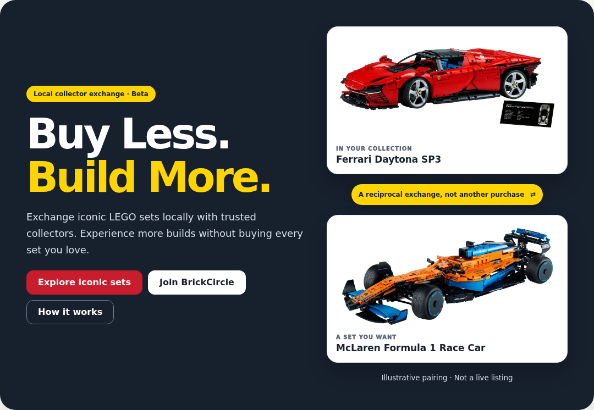
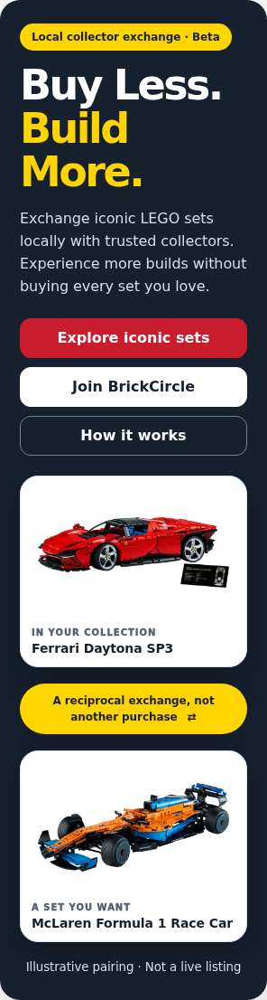

# Landing pairings QA — 2026-10-10

- Branch: `codex/landing-pairings`
- Base: `origin/main` at `fe6a8a378ba44d7c0fd551dfc46ff1efc02339c8`
- Session: `ses_edb27eb80ffemg4Ui3yo8i01OW`

## Scope and catalogue evidence

The signed-out landing page now has normal-flow Own → separator → Want DOM order, unrotated cards, auto-height layout and an entirely separate yellow separator. Legacy mobile percentage widths and fixed showcase heights are removed. Images retain `object-fit: contain`, full captions and descriptive alt text. The reciprocal-example heading is explicitly white on its dark panel.

Existing `tests/isolated/fixtures/curated-catalogue.json` verifies these six IDs:

| Placement | Own | Want |
| --- | --- | --- |
| Hero | Ferrari Daytona SP3 `42143-1` | McLaren Formula 1 Race Car `42141-1` |
| Exchange story | NASA Space Shuttle Discovery `10283-1` | NASA Apollo Saturn V `21309-1` |
| Reciprocal example | Tower Bridge `10214-1` | Colosseum `10276-1` |

The catalogue labels McLaren `McLaren Formula 1 Team 2022 (First Edition)`; the landing uses its familiar product name. Tower Bridge was selected instead of Taj Mahal because it already exists in the curated catalogue. All six actual Brickset images loaded during the focused browser run; no substituted image fixtures or synthetic placeholders were used for this evidence. Examples are explicitly illustrative, with both collectors' ownership and wishlist interests stated. No availability, price or equal-value claim is made. Auth, messaging, admin and camera implementations are unchanged.

## Initial failures and resolution

- The first live-image matrix failed all ten cases (and their retries) at the local clipping assertion. All six images had already loaded and the separator gap/order checks passed. The hero's legacy off-edge decorative `::before` element increased its internal `scrollWidth`, despite the page having no horizontal overflow. These failures were **not** image failures or renewed card/bar overlap. The tests stopped before axe analysis in that run.
- Removed that decorative pseudo-element in the collector theme, rather than weakening the overflow assertion. The next live-image matrix passed 10/10, with no detected WCAG A/AA violations in `.bc-main`.
- Screenshot review then caught a low-contrast reciprocal-example heading, which was fixed with a scoped white heading rule. Removed obsolete mobile showcase sizing rules too.
- Final focused rerun after those changes: **10/10 passed**, no retries. It additionally scrolls the reciprocal example into view and runs a second scoped axe analysis. No detected WCAG 2 A/AA or 2.1 AA violations in the tested scopes. Automated axe checks are not a claim of comprehensive accessibility conformance.

## Final focused matrix

Chromium, widths **320, 360, 390, 768, 1440 CSS px**, height 900px. Each width tested at normal size and with **every computed font size in `.bc-main` doubled**, including pixel-based theme overrides. This is text enlargement/reflow testing, not browser zoom or mobile-device hardware testing.

Assertions cover six loaded images (`naturalWidth > 100`), `contain`, distinct IDs, DOM order, both collectors' mutual interests, a centered static separator with at least 16px clear space above/below (measured 18px), no rotation, no document horizontal overflow, no internal clipping in the hero/cards/separator, and no page JavaScript errors. JSON files record each matrix result.

```sh
BC_EXTERNAL_TEST_SERVER=1 BC_ISOLATED_PORT=4187 \
BC_LANDING_LIVE_IMAGES=1 BC_LANDING_QA_DIR=qa/landing-pairings \
npx playwright test --config=playwright.isolated.config.ts \
  --project=chromium tests/isolated/landing-pairings.spec.ts \
  --retries=0 --max-failures=1
```

The server is the existing `scripts/serve-isolated.mjs` on a dedicated port. Supabase is isolated using the existing browser mock, external APIs are blocked, and only real Brickset/image-fallback hosts are allowed. Without `BC_LANDING_LIVE_IMAGES=1`, this spec runs offline layout/a11y checks and does **not** claim loaded-image validation.

## Other validation

- `npm run typecheck` — passed after final edits.
- `npm run syntax-check` — passed after final edits.
- `npm run release:sync` and `npm run release:check` — synchronized release `20261010-landing-pairings-r1`; check passed after final edits.
- `npm run test:static` — 9/9 passed.
- `git diff --check` — passed.
- Full isolated Chromium suite finished: **388 passed, 3 failed (11.0 minutes)**. It was started before the final scoped CSS/screenshot changes. Two failures were stale landing-copy expectations (Ferrari in the now-space-themed story, and the old overlap caption); one was a test hardcoding port 4173 instead of the dedicated 4187 test origin. Updated only those test expectations: the OAuth assertion still requires loopback and an exact same-origin callback. Reviewed application source and screenshot PNGs remain unchanged. Targeted rerun results are reported on the PR; no full-suite pass or unnecessary full rerun is claimed.

## Screenshots

Follow-up validation: the three affected test files passed **18/18 Chromium tests**, without retries, on port 4187 after the test-only corrections. Typecheck and `git diff --check` also passed. Hosted CI validates the updated head independently.

The existing landing specs now also explicitly assert Saturn V/Discovery mutual interest and that the other collector wants Discovery. A focused **Chromium + Firefox + WebKit** run of `phase-2d-guided-home`, `phase-2e-landing` and `landing-pairings`, with actual images enabled and `--retries=0`, completed: **69/69 passed (23 per browser, 4.8 minutes)**. This includes 30 actual-image/layout/a11y matrix cases (10 per browser). No full local-suite rerun, runtime changes or PNG changes were made for these test corrections.

Tracked PNGs include full landing pages and hero crops at all five widths, normal and enlarged text. Fixed bottom navigation is hidden **only during screenshots** so it does not obscure stitched page/element evidence. Normal navigation remains visible during assertions and axe checks. Browser-preview integration was unavailable (no connected desktop); screenshots were inspected directly as image files.

- [Desktop hero](landing-1440-hero.png) · [Desktop page](landing-1440.png)
- [320px hero](landing-320-hero.png) · [320px page](landing-320.png)
- [320px doubled-text hero](landing-320-text-200-hero.png)
- [360px page](landing-360.png) · [390px page](landing-390.png) · [768px page](landing-768.png)




## Review gate

Open for Codex review and CI. **Do not merge until Codex reviews the final PR head.**
